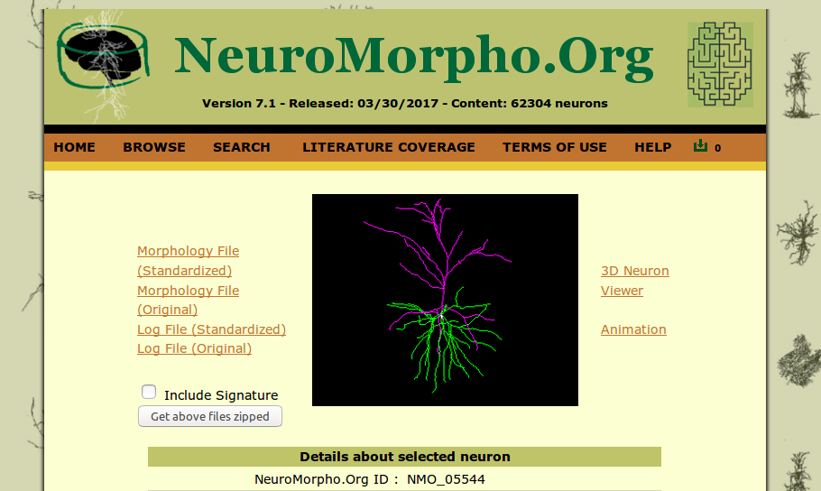
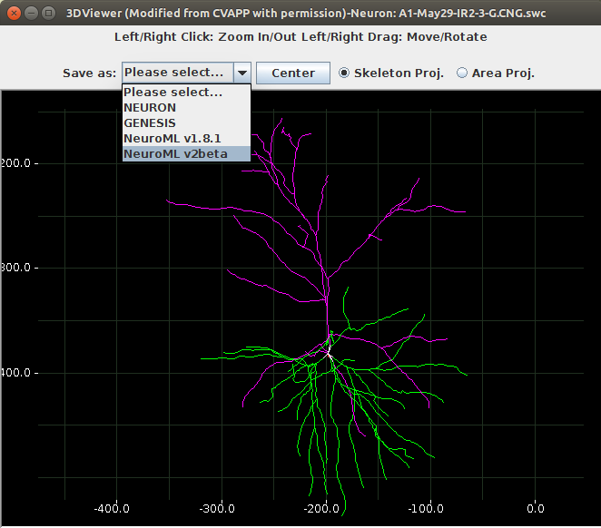
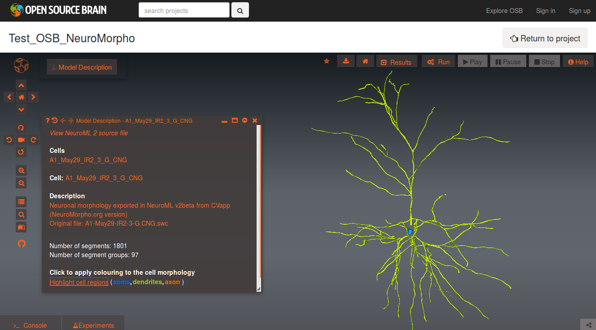

## Cell morphology from NeuroMorpho.Org visualised on Open Source Brain

### Local software requirements

None, apart from an up to date web browser.

### Instructions

#### 1. Download morphology from NeuroMorpho.Org in NeuroML 2 format
 
Pick a cell, e.g. [this one](http://neuromorpho.org/neuron_info.jsp?neuron_name=A1-May29-IR2-3-G)

Select **3D Neuron Viewer**. This will show a 3D view of the cell in an external 
window (a Java Applet running CVapp, see below if you have issues). Select in **Save as** the option
to download in NeuroML2 format.

If the 3D Neuron Viewer does not open you may have to change your setting to allow 
Java Applets to run. See: *"The 3D Neuron Viewer does not launch. What can I do?"* [here](http://neuromorpho.org/myfaq.jsp).

For Mac you may need to specify where the Java Web Start is located (to run the jnlp file). 
When it asks which application to open with, navigate to the root directory (not 
Applications), go to "System" -> "Library" -> "CoreServices" and pick "Java Web Start".

If there is still an issue you can either:
- download the SWC version of the morphology (via **Morphology File (Standardized)**)
- convert the SWC file to NeuroML 2 with a local copy of [CVapp](http://github.com/pgleeson/Cvapp-NeuroMorpho.org), the Java application to visualise SWC files

or 

- get a copy of the NeuroML 2 file [here](files/A1-May29-IR2-3-G.cell.nml).

#### 2. Set up user account on GitHub
 
Get a user account on GitHub: https://github.com/join

#### 3. Add NeuroML file to new repository

Create a new repository (green button on GitHub homepage after you're logged in), 
e.g. named **Test_OSB_NeuroMorpho**. Select **Initialize this repository with a README**

Add the downloaded file(s) to your repository. Select **Upload files** and choose
the *.nml file (or the *.swc file, or both) and add then to the repository

#### 4. Sign up to Open Source Brain

Get an account at http://www.opensourcebrain.org/account/register. 

If you have been given an Activation token for joining OSB (which allows you to 
skip the step of waiting for OSB admins to approve your account) enter it here.

Once your account is approved & you log in, you can enter your GitHub usename
(and other details) on your account settings page (click your username on top right & 
hit **Edit**)

#### 5. Create new project on OSB

Go back to the home page and click **New project** and enter the URL of your repository 
on GitHub. This can be found by clicking the green button **Clone or download** on
GitHub, it will be of the form https://github.com/MYUSERNAME/Test_OSB_NeuroMorpho.git.

Enter a name for your project and select **Create**.

#### 6. Visualise cell in 3D

On the homepage of your new project there will be a button to **Explore model** which
should find the first *.nml model in your Github repository. If there are many or 
none (i.e. only SWC) you can also click **More** and this will list all the files 
in the repo that OSB recognises. 

When the 3D scene loads there will be an option to follow a guided tour of the 
OSB interface. You can follow this, or close the dialog and open it later by pressing the 
book icon on the left.

You should see something like the following when the cell is visualised (and **Model 
description** pressed):

