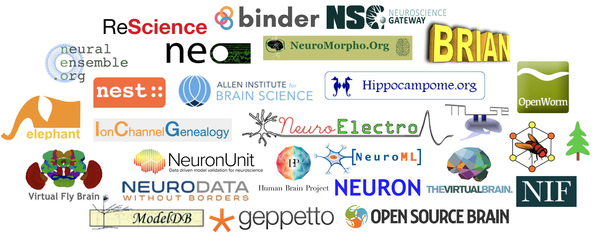

## Neuroinformatics Tutorial

This repository contains slide presentations for a tutorial on neuroinformatics resources for computational modellers. 

### Summary
 
Neuroinformatics resources are becoming an essential part of computational investigations in neuroscience. A movement towards making data and software freely available to the community means that more and more experimental datasets, general purpose analysis tools and infrastructure for computational modelling and simulation are available for computational neuroscientists to help build, constrain and validate their models. 
 
This tutorial will give an overview of the range of neuroinformatics resources currently available to the community. The [first part](https://github.com/NeuralEnsemble/NeuroinformaticsTutorial/tree/master/Part_1_Resources_for_computational_modellers) will give a brief introduction to a number of these under the headings:

- **[Experimental datasets](https://github.com/NeuralEnsemble/NeuroinformaticsTutorial/tree/master/Part_1_Resources_for_computational_modellers#11-experimental-datasets)**
- **[Structured data from literature](https://github.com/NeuralEnsemble/NeuroinformaticsTutorial/tree/master/Part_1_Resources_for_computational_modellers#12-structured-data-from-literature)**
- **[Analysis tools](https://github.com/NeuralEnsemble/NeuroinformaticsTutorial/tree/master/Part_1_Resources_for_computational_modellers#13-analysis-tools)**
- **[Simulation environments](https://github.com/NeuralEnsemble/NeuroinformaticsTutorial/tree/master/Part_1_Resources_for_computational_modellers#14-simulation-environments)**
- **[Model sharing](https://github.com/NeuralEnsemble/NeuroinformaticsTutorial/tree/master/Part_1_Resources_for_computational_modellers#15-model-sharing)**
- **[Computing infrastructure](https://github.com/NeuralEnsemble/NeuroinformaticsTutorial/tree/master/Part_1_Resources_for_computational_modellers#16-computing-infrastructure)**
- **[Open source initiatives](https://github.com/NeuralEnsemble/NeuroinformaticsTutorial/tree/master/Part_1_Resources_for_computational_modellers#17-open-source-initiatives)**
- **[Web portals](https://github.com/NeuralEnsemble/NeuroinformaticsTutorial/tree/master/Part_1_Resources_for_computational_modellers#18-web-portals)**

The [second part](https://github.com/NeuralEnsemble/NeuroinformaticsTutorial/tree/master/Exercises) of the tutorial will involve hands on exercises where multiple resource will be accessed, data transformed and analysed and new models executed. 

This was initially developed by [Padraig Gleeson](https://github.com/pgleeson) (University College London, UK) and [Andrew Davison](https://github.com/apdavison) (CNRS, Gif-sur-Yvette, France) as part of a tutorial at [CNS 2017 in Antwerp](http://www.cnsorg.org/cns-2017-tutorials). It is intended to be developed as an open resource for the wider community. 

Currently this tutorial focuses on neuroinformatics resources which may be of use for those _**creating and analysing computational models of neuronal systems**_. Neuroinformatics has a much wider scope (databases of gene expression in neuronal systems, neuroimaging, clinical data, etc.) and this tutorial can potentially be expanded in future.

 This work is licensed under a <a rel="license" href="http://creativecommons.org/licenses/by/4.0/">Creative Commons Attribution 4.0 International License</a>.

